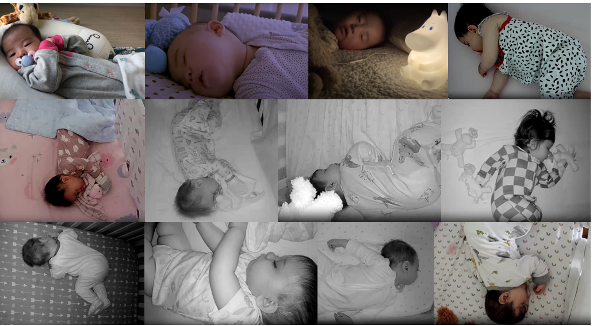
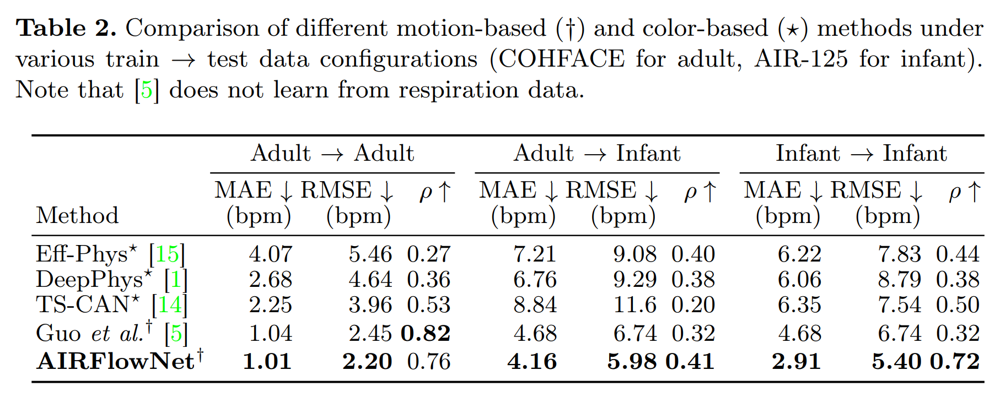

# Automatic Infant Respiration Estimation from Video
Official repository for our paper: [Automatic Infant Respiration Estimation from Video: A Deep Flow-based Algorithm and a Novel Public Benchmark](https://arxiv.org/pdf/2307.13110.pdf).
<p align="center">
  
</p>

## Dataset details
We provide a new manually annotated dataset of 125 videos, Annotated Infant Respiration (AIR-125), for benchmarking respiration estimation methods on infants using videos from baby monitors and Youtube. More details on the dataset generation procedure can be found in the paper.

- AIR-125 can be downloaded from [here](https://coe.northeastern.edu/Research/AClab/AIR-125/).

- We also evaluate our method on an adult respiation datastet, COHFACE. The dataset can be downloaded from [here](https://www.idiap.ch/en/dataset/cohface).

- To generate optical flow inputs for our model generate dense flow outputs using Coarse2Fine optical flow implementation from [here](https://github.com/pathak22/pyflow).

- To train and evaluate methods on these datasets, the dataset paths should be updated in relevant config files as detailed below.

<p align="center">
  
</p>

## Model

We compare our AIRFlowNet model against current physiological signal estimation models and a classical computer vision method that uses pretrained weights:

- DeepPhys: [DeepPhys: Video-Based Physiological Measurement Using Convolutional Attention Networks](https://arxiv.org/abs/1805.07888)

- EfficientPhys: [EfficientPhys: Enabling Simple, Fast and Accurate Camera-Based Cardiac Measurement](https://openaccess.thecvf.com/content/WACV2023/papers/Liu_EfficientPhys_Enabling_Simple_Fast_and_Accurate_Camera-Based_Cardiac_Measurement_WACV_2023_paper.pdf)

- TS-CAN: [MTTS-CAN: Multi-Task Temporal Shift Attention Networks for On-Device Contactless Vitals Measurement](https://papers.nips.cc/paper/2020/file/e1228be46de6a0234ac22ded31417bc7-Paper.pdf)

- Guo et. al: [Remote estimation of respiration rate by optical flow using convolutional neural networks](https://library.imaging.org/admin/apis/public/api/ist/website/downloadArticle/ei/33/8/art00004)

## Results
The following table from the paper compares the above methods against AIRFlowNet on COHFACE and AIR-1245 datasets. Mean absolute error (MAE), root mean squared error (RMSE), and Pearson's correlation coefficient (ρ) are used to compare the methods.

<p align="center">
  
</p>

## Experiments

### Setup
Required packages can be installed following the below steps:
```
$ bash setup.sh
$ conda activate rppg-toolbox
$ pip install -r requirements.txt
```

### Training
Use relavent config files for a specific model-train-validation-test split configuration under configs/train_configs folder.

1. Modify the dataset locations in the config file to an appropriate path.

2. Run the dataset preprocessing (by setting ```DO_PREPROCESS: True``` in the config file) when running the experiments for the first time.

3. Run ```python main.py --config_file ./configs/train_configs/TRAIN_VALIDATION_TEST_MODEL.yaml``` 

### Testing
Use relevant config files for a specific model-test_split configuration under configs/infer_configs folder.

1. Modify the test dataset location in the config file to an appropriate path.

2. Run ```python main.py --config_file ./configs/infer_configs/TRAIN_VALIDATION_TEST_MODEL.yaml```

## Acknowledgement
This repository is based on [rPPG-toolbox](https://github.com/ubicomplab/rPPG-Toolbox). We thank the authors for open sourcing their code.

## Citation

If you find use this code or dataset for your research, please consider citing our paper:
```
@article{manne2023automatic,
  title={Automatic Infant Respiration Estimation from Video: A Deep Flow-based Algorithm and a Novel Public Benchmark},
  author={Manne, Sai Kumar Reddy and Zhu, Shaotong and Ostadabbas, Sarah and Wan, Michael},
  journal={arXiv preprint arXiv:2307.13110},
  year={2023}
}
```
