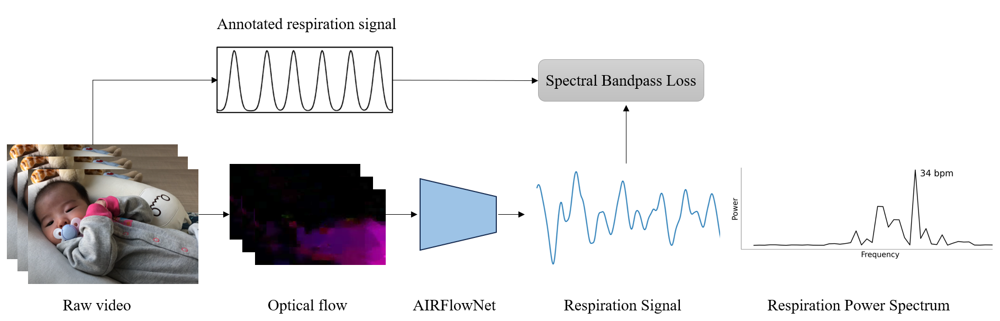

# Video-based Infant Respiration Estimation
Official repository for our paper on infant respiration estimation:
Manne, S.K.R., Zhu, S., Ostadabbas, S., Wan, M., "Video-based Infant Respiration Estimation." Preprint, arXiv:** [cs.CV], 2023.

Fig. 1. *Infant respiration estimation from videos.*

## Dataset generation and details
We create a new dataset for benchmarking respiration estimation methods on infants using public vidoes.
Dataset creation steps including waveform generation scripts in `./data`  

Fig. 2. *Sample frames from the proposed dataset.*

## Color-based estimation
We use rPPG-toolbox for training and testing the color-based models. Models were trained on COHFACE and SCAMPS datasets.
Color tracking based deep learning model training, inference scripts along with a README in `./color`

## Motion-based estimation
Motion tracking based method with sample scripts and a README in `./motion`

## Results
We tested color-based, motion-based models along with two late fusion approaches on adult and infant datasets.

Tab. 1. *Comparison of the color-based, motion-based, and late fusion approaches on the infant dataset.*

Please refer to our paper on implementation and comparison details.